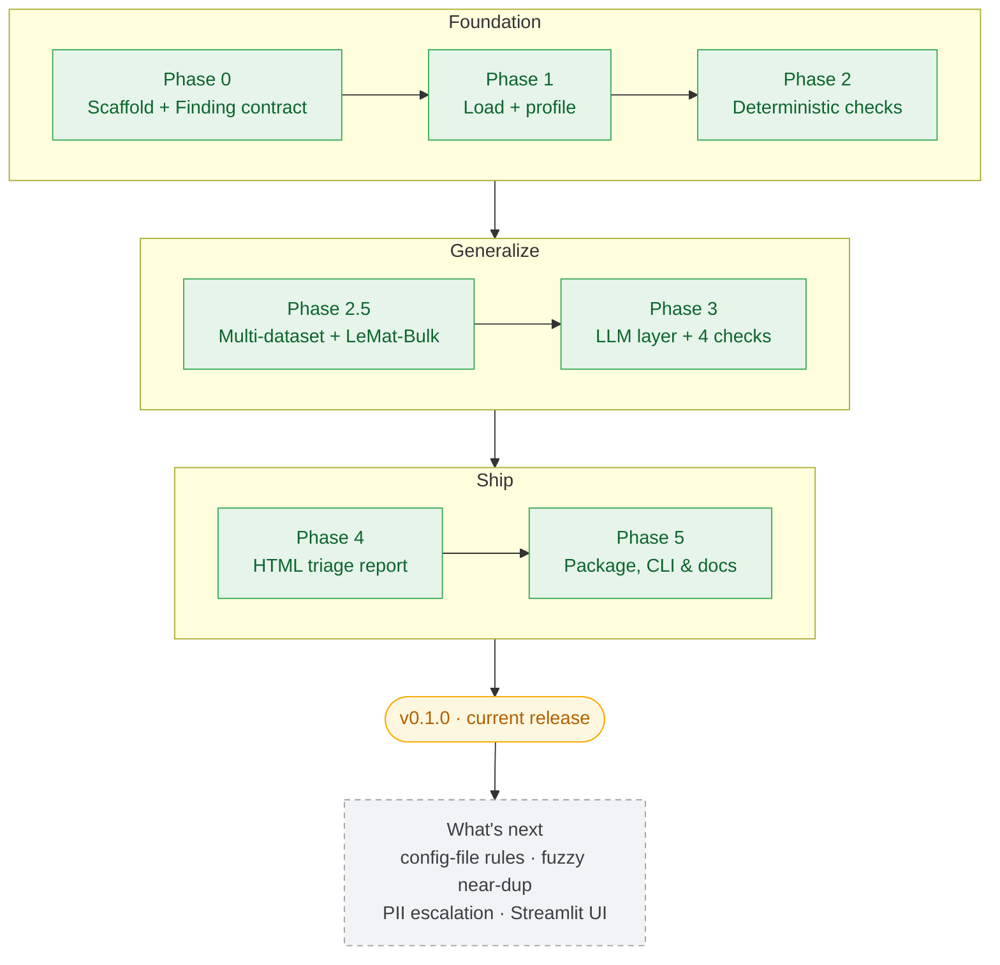

# dataset-auditor


Point heuristics + a *local* LLM at a public scientific dataset and get a clean,
**self-contained HTML report** flagging PII, unit/format inconsistencies, label
noise, and duplicates. Fully local, free, no paid API.

The auditor is **multi-dataset**: per-dataset knowledge lives in a small config
registry, so the check *engines* stay generic. The flagship is
**[LeMaterial/LeMat-Bulk][lemat]** (DFT materials properties harmonized from Materials
Project + OQMD + Alexandria); **NASA Meteorite Landings** is the proving ground.

> Early but functional — `v0.1.0`. Built in public.

### What it does

- 🔍 **Eight deterministic checks** — missing data, impossible / out-of-range values,
  duplicate rows and keys, near-duplicates, cross-field consistency, PII, categorical
  label plausibility, and chemical-formula agreement.
- 🧭 **Found → Expected** on every finding with a concrete target (a range, uniqueness,
  the canonical formula); an honest Evidence → Fix fallback where there is no single
  right answer.
- 🤖 **Advisory local LLM** (vLLM) for research briefings, triage notes, and label
  judgement — it *never* changes a deterministic finding (see [below](#deterministic-vs-the-llm)).
- 📊 **Self-contained HTML triage report** — category rail, severity summary, expandable
  issues, in-browser keep / dismiss / needs-review, CSV export. No external resources.
- 🧩 **Multi-dataset by design** — onboard a dataset by adding one `DatasetSpec`, not new
  check code.

The report is a single self-contained HTML file — a triage dashboard with a health
summary, a per-check category rail, and expandable findings:


Every finding expands to show the evidence, a **Found → Expected** comparison, the
record context, and in-browser keep / dismiss / needs-review controls:


See the full sample audit in **[`examples/`](examples/)** (open `lemat_bulk_report.html`
in a browser).

[lemat]: https://huggingface.co/datasets/LeMaterial/LeMat-Bulk

## Quickstart

```powershell
git clone https://github.com/AmandineFlachs/dataset-auditor.git
cd dataset-auditor
uv pip install -e ".[cli,report,load]"   # CLI + HTML report + loader deps
python scripts/acquire_meteorites.py     # fetch the demo dataset (data/ is git-ignored)
auditor run --dataset meteorites --out report.html --open
```

`data/` is git-ignored, so the datasets are fetched by small acquire scripts rather than
committed: `acquire_meteorites.py` for the proving ground above, and `acquire_lemat.py`
for the flagship LeMat-Bulk sample (see [Datasets](#datasets)).

`auditor run` audits a dataset and writes a single self-contained HTML report — a
**triage view**: a category rail, a summary strip leading with count and severity
plus the clean-rate, and a grouped, expandable issue stream. Identical findings are
aggregated; each issue expands to show evidence, the suggested fix, and the source
record, and can be marked keep / dismiss / needs-review (saved in the browser, and
exportable to CSV). The layout was built from a Claude Design handoff; it stays fully
self-contained (system fonts, no external resources). Other commands:

```powershell
auditor datasets                          # list available datasets
auditor run -d meteorites -s my.csv       # audit any CSV with a chosen spec
auditor profile -d meteorites             # exploratory profile (no findings)
auditor brief -d lemat_bulk -o brief.md   # local-LLM domain briefing (needs a server)
auditor triage -d lemat_bulk              # prioritize findings; LLM adds notes (needs a server)
```

`auditor triage` collapses the findings into distinct issues and orders them by a
**deterministic** priority (severity, then affected rows); a local LLM adds a plain
summary and a "what to check" line per issue. The priority never depends on the model,
and the order still prints if no server is running. The model is deliberately *not*
asked to judge real-defect-vs-expected: a smaller 14B got that wrong (it called the
expected cross-functional duplicate ids a defect to "remove"), so triage is scoped to what the
model is reliable at — orientation and suggesting what to verify.

Sample reports for both flagships live in [`examples/`](examples/), alongside the
live local-LLM research briefings (`*_briefing.md`) from `auditor brief` and the
triage (`lemat_bulk_triage.md`) from `auditor triage`. The LeMat-Bulk report is the
genuine audit of the real sample **plus five deliberately-planted `formula.*` defects**
— the real data is clean on that axis, so the planting is what lets the example *show*
the formula check firing. It is planted in memory only (the data is untouched) and
fully reproducible: `python scripts/make_example_report.py`, which lists exactly what
it corrupts.

## Design in one sentence

Every check returns a list of `Finding` objects with the same schema, so the
report layer is generic. Add a new check → the report renders it for free.

## Deterministic vs. the LLM

Everything the report asserts as a fact is **deterministic**. Unplug the local LLM
and the audit is unchanged: every error- and warning-level finding (out-of-range
values, duplicates, near-duplicates, missing data, formula disagreements, cross-field
inconsistencies) comes from plain Python with no model in the loop. The evidence, the
severity, and the Found → Expected target are all computed, not generated.

The local LLM is **advisory only**, in three clearly-bounded places, and it never
overrides a deterministic finding:

| Where | What the LLM does | If the server is off |
|---|---|---|
| `auditor brief` | Writes a research briefing (column meanings, plausible ranges, pitfalls, *suggested* checks) from column **metadata only — never raw rows**. A separate command, not part of `run`. | The briefing is skipped; the audit is unaffected. |
| `auditor triage` | Ranking is **deterministic** (severity, then affected rows). The model only adds a plain summary and a "what to check" line per issue. | The priority order still prints, without the notes. |
| `checks/labels.py` | The one check that asks the model to judge whether a categorical value is plausible given the row. Its findings are **warn/info** ("a human confirms"), it samples rather than scans, and both flagships leave it disabled. | One `info` finding ("skipped"); every other check runs untouched. |

So the LLM can *originate* a finding in exactly one opt-in place (`labels.py`), and
only at advisory severity — it is never allowed to assert a hard error, and it cannot
change, suppress, or re-rank a deterministic one. The audit you can defend in front of
a scientist is the deterministic core; the LLM is there to orient and explain, and it
is held to that on purpose (a smaller 14B confidently mis-judged an *expected* cross-functional
duplicate as a defect, which is exactly why triage does not let it render verdicts).

## Architecture

```
src/auditor/
├── models.py     # Finding, Severity: the shared data contract
├── datasets.py   # DatasetSpec registry: all per-dataset knowledge as data
├── load.py       # dataset/CSV -> normalized pandas DataFrame
├── llm.py        # thin client for the local LLM (vLLM, OpenAI-compatible)
├── checks/       # schema, units, duplicates, consistency, near_dup, pii, labels,
│                 #   formula: each -> list[Finding]
├── glossary.py   # plain-language names + severity words for the report
├── research.py   # `auditor brief`: metadata-only LLM research briefing
├── triage.py     # `auditor triage`: deterministic priority + advisory LLM notes
├── report.py     # Jinja2 -> a single self-contained report.html
└── cli.py        # the `auditor` CLI: run / datasets / profile / brief / triage
templates/
└── report.html.j2  # the Triage report template (inline CSS + JS, self-contained)
```

## Datasets

A `DatasetSpec` (`auditor/datasets.py`) collects everything dataset-specific
(rename map, numeric columns, unique key, plausibility rules) as **data**, so the
check *engines* stay generic. Onboarding a dataset is: add one spec, author its
rules. The checks don't change.

```powershell
auditor run                          # default: LeMat-Bulk (flagship)
auditor run --dataset meteorites     # the proving ground
```

`data/` is git-ignored, so each dataset is fetched by a small acquire script:

```powershell
python scripts/acquire_meteorites.py   # the proving ground (~45k rows, public mirror)
python scripts/acquire_lemat.py        # the flagship sample, across all four configs
```

The LeMat-Bulk script draws a reproducible random sample of the scalar science columns
across all four configs (`compatible_pbe/pbesol/scan`, `non_compatible`).

## Roadmap

Everything through **`v0.1.0` is ✅ done** — including the live local-LLM runs
(`brief`, `triage`, label judging) against a real vLLM server.



| Phase | What | Status |
|---|---|---|
| 0 | Scaffold + `Finding` contract | ✅ Done |
| 1 | Load + profile a dataset (meteorites, the origin) | ✅ Done |
| 2 | Deterministic checks (schema / units / exact dups) | ✅ Done |
| 2.5 | Generalize to multi-dataset + adopt **LeMat-Bulk** flagship | ✅ Done |
| 3 | LLM foundation + consistency / near-dup / PII / labels checks | ✅ Done |
| 4 | HTML report (Triage layout: rail, summary strip, expandable issues) | ✅ Done |
| 5 | Package + CLI (`auditor run`), docs | ✅ Done |
| D | Live local-LLM runs (`brief`, `triage`, label judging) | ✅ Done |

### Phase 3 in detail

Phase 3 added the LLM-assisted layer without compromising reusability: every new
check is a **generic engine** configured by a `DatasetSpec`. Done:

1. **`auditor.llm`** — a thin local-vLLM client that *degrades gracefully* when the
   server is offline (one info finding, deterministic checks untouched).
2. **`consistency.py`** — *rows sharing a key should agree.* On LeMat-Bulk the same
   `immutable_id` recurs once per functional, so the rule asserts identical
   **structure**; energies are deliberately not compared (they differ legitimately
   across functionals). Honestly clean on the sample.
3. **`near_dup.py`** — *same content, different identity = a probable duplicate.* On
   LeMat this **fires on real data**: 240 rows where one `entalpic_fingerprint` spans
   multiple `immutable_id`s (a structure ingested from several source DBs).
4. **`pii.py`** — regex tier (email/SSN/card/phone/IP) with masked evidence; scans
   only declared text columns. Fixture-demonstrated (no PII in the flagships).
5. **`labels.py`** — LLM-judged categorical plausibility, the first consumer of
   `auditor.llm`. Samples, degrades gracefully, fixture-demonstrated.

6. **`formula.py`** — the one genuinely materials-specific check, kept as an
   *opt-in, dormant-by-default* domain pack (runs only when a spec sets
   `formula_rules`, so meteorites never sees it). The three OPTIMADE formula columns
   are redundant encodings of one composition, so disagreement is an internal
   contradiction (`error`); the `elements` list and `nelements` count ride along as
   cross-checks. Deliberately dependency-free — the columns have a trivial regular
   grammar and are compared against each other, not external chemistry. Honestly
   clean across all 25k LeMat rows; a crafted-defect test proves it fires.

A multi-agent **compound-engineering review pass** then hardened the codebase (11
verified issues fixed/pinned with tests). See [`ROADMAP.md`](ROADMAP.md) for the full
breakdown.

## Flagship: LeMaterial/LeMat-Bulk

DFT materials properties (formula representations, formation energy, density of
states at the Fermi level, magnetization, …) harmonized from several source
databases. It was chosen by measuring audit-richness across candidate datasets:
unlike competition-clean ML benchmarks, LeMat-Bulk is *measurably messy*,
precisely because it reconciles databases that disagree.

A lesson worth recording: a naive sample from the cleanest config looked
deceptively pristine. Sampling **across all four configs** (`compatible_pbe`,
`compatible_pbesol`, `compatible_scan`, `non_compatible`) surfaced the real
signal: `dos_ef` ~37% null, a 3-way `functional` categorical, and many materials
recurring across functionals. Profiling before building, again.

Deterministic findings (`python -m auditor.checks --dataset lemat_bulk`, 25k-row
sample):

```
total findings: 363   (error=122, warn=241)
  near_dup.shared_content    240   one entalpic_fingerprint under several immutable_ids
  duplicates.duplicate_key   122   same immutable_id across DFT functionals
  schema.high_null_rate        1   dos_ef ~37% null (computed for only some entries)
```

The headline here is **duplicates + missingness**, not impossible values. This is
rigorous computational data, so the range check is (honestly) clean — and so, it
turns out, is the Phase-3 consistency check: profiling confirmed that every row
sharing an `immutable_id` agrees on its structure, so the data is sound on that
axis too. (The originally-planned "conflicting energies across functionals" finding
was dropped during the build: DFT total energies are not comparable across
exchange-correlation functionals, so that spread is expected physics, not a defect.)
The formula-agreement domain pack closes the last open question the same way: across
all 25k rows the three OPTIMADE formula columns, the `elements` list, and `nelements`
all agree, so the flagship is clean on that axis too. The check exists to catch the
ingest defect (mismatched formula encodings) the instant one appears.

## Origin / proving ground: NASA Meteorite Landings

The deterministic checks were first built and validated against **NASA Meteorite
Landings** (45,716 rows, 10 fields). Loaded via `auditor.load.load()`, which
normalizes structure (column names, a stable `row_id`, numeric dtypes) but
deliberately leaves bad values untouched.

Profile highlights (`python src/auditor/load.py meteorites`):

| Signal | Observation |
|---|---|
| `year` range | **301 → 2501**, at least 2 rows dated in the future |
| `(reclat, reclong) == (0, 0)` | **6,214 rows (13.6%)** parked on "null island" |
| `reclong` range | max **354.47**, outside the valid **[−180, 180]** |
| `mass_g` | min **0** (impossible), 131 missing |
| missing coords | `reclat`/`reclong` ~16% null |
| exact duplicate rows | **0** |

Three hypotheses (impossible years, null-island placeholders, out-of-range
physical values) were all **confirmed by running detectors**, not just eyeballing.
A pre-profiling hypothesis ("many exact duplicate rows") was **disproven** (zero
full-row duplicates), which saved building a check for a problem that didn't exist.

Phase-2 findings on the full meteorite dataset:

```
total findings: 6,239   (error=22, warn=6,217)
  units.null_island      6,214   rows at exactly (0, 0)
  units.out_of_range        22   longitude > 180, future years, mass <= 0
  schema.high_null_rate      3   reclat / reclong / geolocation ~16% null
  duplicates                 0   no exact-row or duplicate-id collisions
```

## Local LLM setup

The LLM-assisted checks talk to a local [vLLM](https://docs.vllm.ai) server over
its OpenAI-compatible `/v1` API (run it however you like, e.g. in WSL). No data
leaves your computer.

The client (`auditor.llm`) and the LLM-judged check (`auditor.checks.labels`) are
built and tested against a mocked client, and **degrade gracefully** when no server
is running (one `info` finding; the deterministic checks are unaffected). The current
runtime is **Qwen3.6-27B**, served by vLLM on a 24 GB GPU. The advisory-only design and
the first live runs of `brief`, `triage`, and label judging were validated on a smaller
**Qwen2.5-14B-AWQ** (a useful worst case, and the source of the model misjudgement noted
above). Point the client elsewhere with `AUDITOR_LLM_BASE_URL` / `AUDITOR_LLM_MODEL`. See
[Deterministic vs. the LLM](#deterministic-vs-the-llm) for exactly where the model is and
isn't in the loop.

## Development

```powershell
uv venv
uv pip install -e ".[cli,report,load,llm,dev]"   # everything except the heavy checks extra
python scripts/acquire_lemat.py   # fetch the flagship sample (data/ is gitignored)
uv run pytest
```

Optional dependencies are grouped by phase in `pyproject.toml` (`load`, `checks`,
`llm`, `report`, `cli`, `dev`) so the data contract and its tests install without
pulling in pandas, httpx, jinja2, or torch. Install only what you need.

## License

MIT
